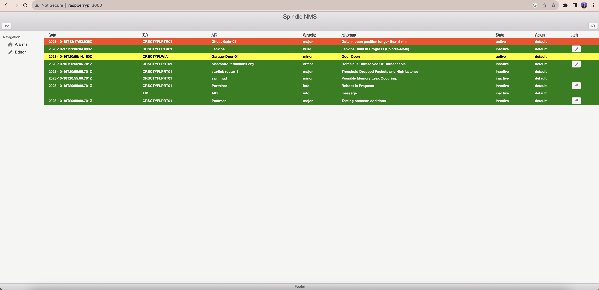

# Spindle LMS
Spindle LMS is a lightweight monitoring system alarm board designed for home labs, home automation, small networks and small footprint applications. It's designed to run on premise containers and gives access to a REST api that allows alarms points to be created and turned on and off.

# Versions
Currently there are two version of Spindle LMS. There is a self contained nextjs version with only a file system db, and this version 2 with hibernate external database support.

This version is designed to be pulled and built using CI/CD processes from you own git repository, therefore the config.yml file will be specific to your environment.

# Installation
How to start the SpindleNms2 application for development
---

1. Run `mvn clean install` to build your application
1. The database will be created automatically for you, however you will need to provide some alarms for it. It will start off blank. Please use the editor.
1. Start application with `java -jar target/spindle-nms2-1.0-SNAPSHOT.jar server config.yml`
1. To check that your application is running enter url `http://localhost:3000`

Health Check
---
To see your applications health enter url `http://localhost:3001/healthcheck`
